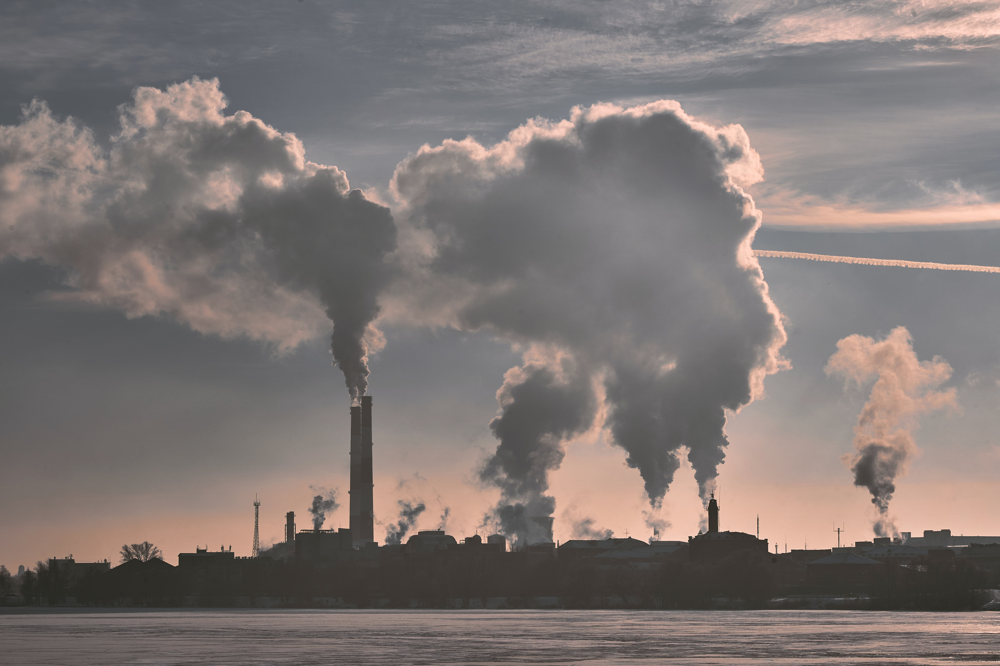

# 🌍🔬 Examining Product Carbon Footprints 📊🌱

📚 This SQL project delves into the fascinating realm of product carbon footprints (PCFs) to explore the environmental impact of various products. The dataset, sourced from nature.com, provides valuable insights into the greenhouse gas emissions associated with different companies and their products. 🌍♻️

🔍 The primary focus of this analysis is to investigate and quantify the carbon footprint of products across different stages of production. 

## 📋 Data Description

Photo by Maxim Tolchinskiy on Unsplash

_Greenhouse gas emissions attributable to products&mdash;from food to sneakers to appliances&mdash;make up more than 75% of global emissions._ -[The Carbon Catalogue](https://www.nature.com/articles/s41597-022-01178-9)

# Examining Product Carbon Footprints

The data, which is publicly available on [nature.com](https://www.nature.com/articles/s41597-022-01178-9), contains product carbon footprints (PCFs) for various companies. PCFs are the greenhouse gas emissions attributable to a given product, measured in CO2 (carbon dioxide equivalent).

This data is stored in a PostgreSQL database containing one table, `product_emissions`, which looks at PCFs by product as well as the stage of production these emissions occurred in. Here's a snapshot of what `product_emissions` contains in each column:

### `product_emissions` Table

| field                              | data_type |
|------------------------------------|-----------|
| id                                 | VARCHAR   |
| year                               | INT       |
| product_name                       | VARCHAR   |
| company                            | VARCHAR   |
| country                            | VARCHAR   |
| industry_group                     | VARCHAR   |
| weight_kg                          | NUMERIC   |
| carbon_footprint_pcf               | NUMERIC   |
| upstream_percent_total_pcf         | VARCHAR   |
| operations_percent_total_pcf       | VARCHAR   |
| downstream_percent_total_pcf       | VARCHAR   |

## Analysis: Carbon Footprint by Industry in 2017

industry_group                   | count_industry | total_industry_footprint
----------------------------------|----------------|-------------------------
Materials                        | 11             | 107,129.0
Capital Goods                    | 4              | 94,942.7
Technology Hardware & Equipment  | 22             | 21,865.1
Food, Beverage & Tobacco         | 22             | 3,161.5
Commercial & Professional Services | 2              | 740.6
Software & Services              | 1              | 690.0

Conclusion
Based on the analysis of the product carbon footprints in 2017, the industries with the highest total carbon footprints are:

- Materials with a total footprint of 107,129.0
- Capital Goods with a total footprint of 94,942.7
- Technology Hardware & Equipment with a total footprint of 21,865.1

On the other hand, the industries with relatively lower total carbon footprints are:

- Food, Beverage & Tobacco with a total footprint of 3,161.5
- Commercial & Professional Services with a total footprint of 740.6
- Software & Services with a total footprint of 690.0

## 📑 Queries and Code

The SQL queries used in this project can be found in the [jupyter notebook](carbon_emissions_analysis.ipynb.ipynb) file. 

To examine the carbon footprint of each industry in the dataset, the following SQL query was used:

### 🧑‍💻 Query example: 

### 👨‍🔬 Query output:

